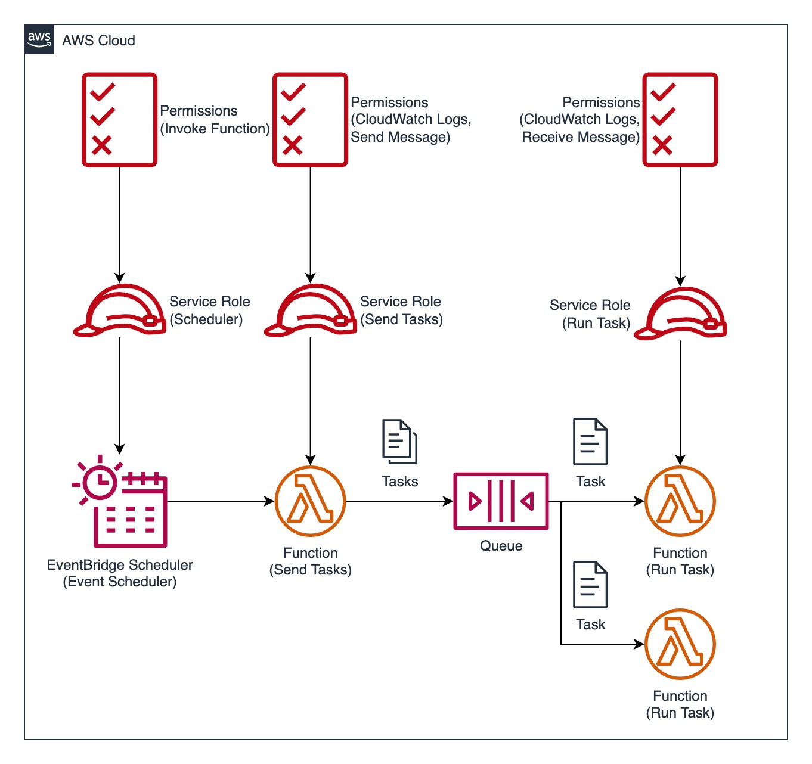

# CDK Lab - Serverless Task Scheduler<!-- omit from toc -->

I used to schedule some cron tasks and send the results to IM application, such as Slack, Discord ...etc.

What I did before was implementing a gigantic, stable, famous workflow platform like [Apache Airflow](https://airflow.apache.org) and [Prefect](https://www.prefect.io). They are still good choices, but it's time for me to adopt a lighter, event-driven architecture.

When talk about AWS, we can use Amazon EventBridge, AWS Lambda, Amazon SQS to build the same architecture to fulfill the same job:


Hope this will cost less money and effort. Let's get hands dirty 🛠️ and have the party started! 🎉

- [Components](#components)
- [Deployment](#deployment)
  - [Step 1: Configure AWS Credentials](#step-1-configure-aws-credentials)
  - [Step 2: Set the stacks' prefix](#step-2-set-the-stacks-prefix)
  - [Step 3: Reset the scheduler](#step-3-reset-the-scheduler)
  - [Step 4: Create Task Definitions](#step-4-create-task-definitions)
  - [(Optional) Step 5: Install Python Lambda Layer (Python dependencies)](#optional-step-5-install-python-lambda-layer-python-dependencies)
  - [Step 6: Add Business Logic Code](#step-6-add-business-logic-code)
  - [(Optional) Step 6: Change time related parameters of SQS Queue](#optional-step-6-change-time-related-parameters-of-sqs-queue)
  - [Step 7: Deploy with CDK toolkit (`cdk` command)](#step-7-deploy-with-cdk-toolkit-cdk-command)
  - [(Optional) Step 8: Clean all resources](#optional-step-8-clean-all-resources)
- [Some Development Tips \& Explainations](#some-development-tips--explainations)
  - [Role creation](#role-creation)
  - [JSON serialization in Lambda function](#json-serialization-in-lambda-function)

## Components



All we need are:

* **EventBridge Scheduler (Event Scheduler)**: Scheduler to invoke a Lambda function with a Role attached
  * **Service Role**: Has permission to invoke a Lambda function
* **Lambda function (Send Tasks)**: Send messages to queue with a Role attached
  * **Service Role**: Has permission to send messages to SQS, and manage CloudWatch logs
* **Queue**: Store the tasks
* **Lambda function (Run Task)**: Receive messages from queue with a Role attached
  * **Service Role**: Has permission to receive message from queue, and manage CloudWatch logs

## Deployment

### Step 1: Configure AWS Credentials

Install [AWS CLi](https://docs.aws.amazon.com/cli/latest/userguide/getting-started-install.html) first, then create the config file by executing:

```bash
aws configure
```

### Step 2: Set the stacks' prefix

The deployed stack has a prefix, the default value is `cdklab`. Edit the value in [runtime context](https://docs.aws.amazon.com/cdk/v2/guide/context.html) file (`cdk.context.json`):

```json
{
  "prefix": "cdklab"
}
```

### Step 3: Reset the scheduler

The default schedule is set at 23:59:59 on 2037-12-31, Refer to `stacks.scheduler_stack.scheduler_lambda`.

Choose to set it as an rate-based, cron-based or one-time job ([Reference](https://docs.aws.amazon.com/scheduler/latest/UserGuide/schedule-types.html)), and replace the value string of the `schedule_expression` parameter that follows the syntax below:

* For [rated-based job](https://docs.aws.amazon.com/scheduler/latest/UserGuide/schedule-types.html#rate-based), the syntax is `rate(value unit)`
* For [cron-based job](https://docs.aws.amazon.com/scheduler/latest/UserGuide/schedule-types.html#cron-based), the syntax is `cron(minutes hours day-of-month month day-of-week year)`
* For [one-time job](https://docs.aws.amazon.com/scheduler/latest/UserGuide/schedule-types.html#one-time), the syntax is `at(yyyy-mm-ddThh:mm:ss)`

And set the timezone by replacing the value of the `schedule_expression_timezone` parameter with the [TZ identifier](https://en.wikipedia.org/wiki/List_of_tz_database_time_zones) like `Asia/Taipei`.

### Step 4: Create Task Definitions

By default, the tasks are stored in the `tasks` List object in `lambda/send_task/index.py`. Such as:

```python
tasks = [
  "Hello from Lambda #1!",
  "Hello from Lambda #2!",
]
```

Simply modify the content and each String object will be the task that the next (run-task) Lambda function should execute with.

If the task definitions is much larger than this example, try store into another text file then read it in:

```python
# e.g. The tasks are now in tasks.txt, each line represents a unique task definition
with open("tasks.txt", "r") as file:
    tasks = file.open().splitlines()
```

### (Optional) Step 5: Install Python Lambda Layer (Python dependencies)

All Python dependencies must stored under `layer/python` as [Lambda Layer](https://docs.aws.amazon.com/lambda/latest/dg/configuration-layers.html) then pack and send to AWS Lambda.

First add the dependencies to `requirements-layer.txt`, then install the dependencies with the command below: 

```bash
pip install --target ./layer/python -r requirements-layer.txt
```

> [NOTE] Remember to manually add dependencies to `requirements-layer.txt`.

### Step 6: Add Business Logic Code

Insert the code into `lambda/run_task/index.py`.

### (Optional) Step 6: Change time related parameters of SQS Queue

There are 4 parameters:

* [`visibility_timeout`](https://docs.aws.amazon.com/AWSSimpleQueueService/latest/SQSDeveloperGuide/sqs-visibility-timeout.html): How long does a Lambda function process the task?
  * Default value: `1` minute
* [`retention_period`](https://docs.aws.amazon.com/AWSSimpleQueueService/latest/APIReference/API_SetQueueAttributes.html#API_SetQueueAttributes_RequestSyntax): How long does the task remain in the queue?
  * Default value: `15` minutes
* [`receive_message_wait_time`](https://docs.aws.amazon.com/AWSSimpleQueueService/latest/SQSDeveloperGuide/): How long does the "ReceiveMessage" (Polling) action takes?
  * Default value: `0` minute (Immediate)

Estimate the settings by the program you goona run, end override them by editing the `stack/sqs_stack.py` file.

### Step 7: Deploy with CDK toolkit (`cdk` command)

[Install the CDK toolkit](https://docs.aws.amazon.com/cdk/v2/guide/cli.html) then deploy by executing:

```bash
cdk deploy --all --require-approval=never
```

### (Optional) Step 8: Clean all resources

Not going to use these anymore? Remove them with:

```bash
cdk destroy --all
```

## Some Development Tips & Explainations

### Role creation

CDK will try to create roles and add necessary permission policies by evaluate the resources that are going to be created. So, if we create a Lambda function, and set a SQS Queue to trigger the function, CDK will automatically create the policies below:

* CloudWatch log related policies
* Read SQS Queue message related policies

But there are exceptions in this project:

1. If the action is written in Lambda function, CDK won't understand what permission does the function need (Refer to `stacks.lambda_stack.lambda_sendtask`)
2. If we use L1 construct to create the resources, everything in the CloudFormation template should be created by ourselves (Refer to `stacks.scheduler_stack.scheduler_lambda`)

If these situations exists, try to create the Roles and Policies manually first.

### JSON serialization in Lambda function

We can use the standard `JSON` library and call `json.dumps()` function to acomplish the serialization process. But try to do with the code below:

```python
import json

json.dumps(json)
# TypeError: Object of type module is not JSON serializable
```

Error occurs: module object can not be JSON serialized. Sometimes it's annoying because we can't realize if the object is serializable or not at a glance.

[JSONPickle](https://github.com/jsonpickle/jsonpickle) is an amazing project for JSON serialization. The reason to use JSONPickle better than calling `json.dumps` is based on the project itself's description:

> "It can take almost any Python object and turn the object into JSON"

We added into the Python Lambda Layer by default and already implemented into the Lambda function. Try and enjoy it! 🍻
